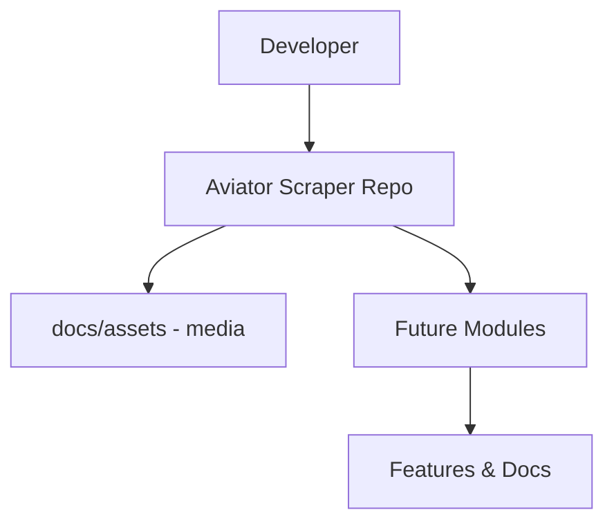

<p align="center">
  
</p>

<p align="center">
  
  
  
</p>

> **Developed by [Arslan Malik](https://github.com/arsalanmaalik461)**
> 📱 WhatsApp: [+92 300 8987448](https://wa.me/923008987448) · 🌐 Website: [arslanmalik.tech](https://arslanmalik.tech)

---

## 🌟 Executive Overview

Aviator Scraper is currently a fresh, empty repository — a clean starting point reserved for a project named "Aviator Scraper". Nothing has been committed yet, so the code, stack, and feature set are still to be decided. This README sets up the project foundation so the repository looks professional and ready to build on from day one.

The repository follows a standard open-source layout with a dedicated `docs/assets/` folder for project media and a structured README that will grow alongside the codebase. As modules are added, the sections below — features, showcase, architecture, quickstart, and project structure — will be filled in to document exactly what the project does and how to run it.

---

## 📑 Table of Contents

- [✨ Key Features & Highlights](#-key-features--highlights)
- [🖥️ Feature Showcase](#️-feature-showcase)
- [🏗️ System Architecture](#️-system-architecture)
- [🚀 Quickstart & Installation Guide](#-quickstart--installation-guide)
- [📂 Project Structure](#-project-structure)
- [🛡️ Security & Notes](#️-security--notes)

---

## ✨ Key Features & Highlights

| Feature | Description |
| :--- | :--- |
| Clean slate | Empty repository — no legacy code, no tech debt, ready for any stack |
| Structured docs | README + `docs/assets/` media folder established from the start |
| Scalable layout | Standard open-source structure that grows with the project |

---

## 🖥️ Feature Showcase

### 1. Fresh Repository Foundation

> A clean, documented starting point — every future feature will be documented here as it lands.

- Empty repo with a professional README and banner already in place
- `docs/assets/` folder ready for screenshots, diagrams, and media
- Placeholder sections (features, architecture, quickstart) waiting to be filled with real detail

---

## 🏗️ System Architecture



---

## 🚀 Quickstart & Installation Guide

### Prerequisites

- A GitHub account with access to this repository
- Git installed locally
- Your chosen runtime/toolchain (to be documented once the stack is decided)

### Step-by-Step Installation

```bash
# 1. Clone the repository
git clone https://github.com/arsalanmaalik461/aviator-scraper.git
cd aviator-scraper

# 2. Start building — add your code, then document it here
```

---

## 📂 Project Structure

```
aviator-scraper/
├── docs/
│   └── assets/
│       └── banner.svg      # Project banner
└── README.md               # This file
```

---

## 🛡️ Security & Notes

- This repository is currently empty — no secrets, keys, or credentials are stored here.
- Never commit API keys, tokens, or passwords; use environment variables or a secrets manager.
- The stack and feature documentation will be added here as development begins.

---

<p align="center">
  <sub>Developed with ❤️ by <a href="https://github.com/arsalanmaalik461">Arslan Malik</a> · 📱 <a href="https://wa.me/923008987448">WhatsApp: +92 300 8987448</a> · 🌐 <a href="https://arslanmalik.tech">arslanmalik.tech</a></sub>
</p>
